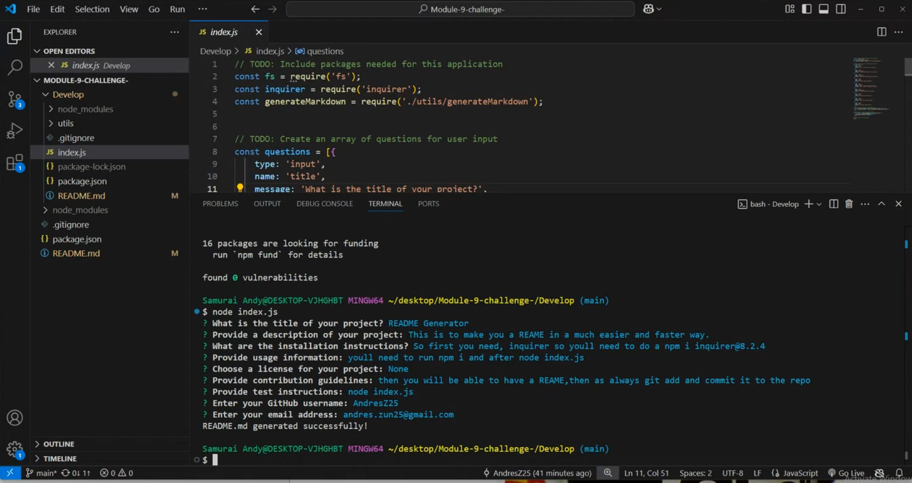

# README Generator 

[How to create a Professional README](https://coding-boot-camp.github.io/full-stack/github/professional-readme-guide)

# Description

The Professional README Generator is a command-line application designed to help developers create high-quality README files efficiently. By answering a series of prompts, users can generate a complete README file with key sections such as Description, Installation, Usage, License, Contributing, Tests, and Questions. This ensures projects are well-documented, organized, and professional-looking. This tool streamlines the process of creating a README by prompting users for project details, including title, description, installation steps, usage instructions, and license selection. A corresponding badge is automatically included to indicate the chosen license. Additionally, links in the Table of Contents make navigation within the README seamless.

# Acceptance Criteria

GIVEN a command-line application that accepts user input

WHEN I am prompted for information about my application repository

THEN a high-quality, professional README.md is generated with the title of my project and sections entitled Description, Table of Contents, Installation, Usage, License, Contributing, Tests, and Questions

WHEN I enter my project title

THEN this is displayed as the title of the README

WHEN I enter a description, installation instructions, usage information, contribution guidelines, and test instructions

THEN this information is added to the sections of the README entitled Description, Installation, Usage, Contributing, and Tests

WHEN I choose a license for my application from a list of options

THEN a badge for that license is added near the top of the README and a notice is added to the section of the README entitled License that explains which license the application is covered under

WHEN I enter my GitHub username

THEN this is added to the section of the README entitled Questions, with a link to my GitHub profile

WHEN I enter my email address

THEN this is added to the section of the README entitled Questions, with instructions on how to reach me with additional questions

WHEN I click on the links in the Table of Contents

THEN I am taken to the corresponding section of the README

# Installation

1. Create a GitHub repository.

2. Name it "README Generator".

3. Clone it to your desktop.

4. Open it in VS Code.

5. Run npm init -y to generate package.json.

6. Install dependencies by running npm i inquirer.

7. Create the index.js file to build your application logic.

8. Write the required prompts using Inquirer for user inputs.

9. Add functionality to generate a README.md file with the provided information.

10. Add dynamic sections like License badges and links to the Table of Contents.

11. Test the application to ensure all functionality works as expected.

12. Create the README.md file with installation and usage instructions.

13. Push the project to GitHub.

and here is the link to the video as well 
https://app.screencastify.com/v3/watch/elxricPLVqfhIOQQrOF6

this image shows how it looks

